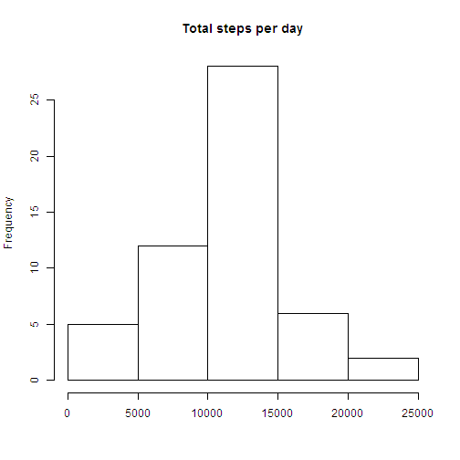
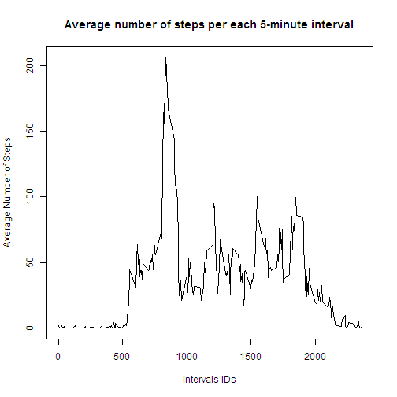
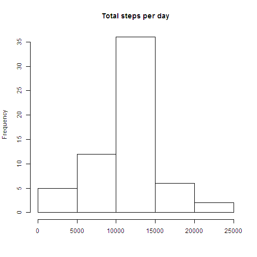
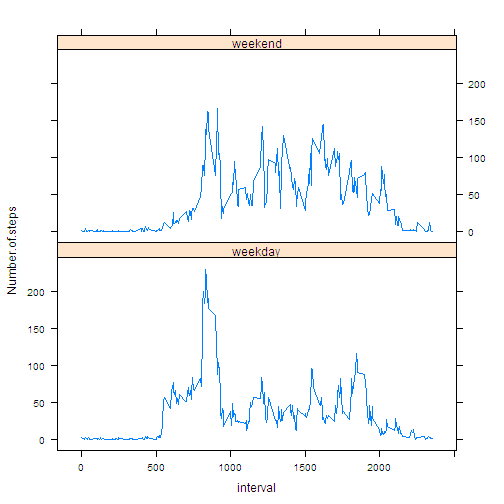

## Loading and preprocessing the data
Though this is superfluous to the assignment, I'll use the code to check if the data file exists and unzip the activity.zip file provided in the repository if activity.csv doesn't exist.  


```r
if (!file.exists("activity.csv")) {
        unzip("activity.zip")
}
```

Now load the data  

```r
data <- read.csv("activity.csv")
```
Create a summary data table with total number of steps per each date

```r
##get a vector of dates
dates <- levels(data$date)
##create a vector to store total steps for each date
totaldaily <- c()
##loop through dates to calculate total steps per each day and store it in totaldaily vector
##note that I do not replace o remove NAs in sum function so that we do not introduce zeroes 
##into data instead of NAs
for (i in 1:length(dates)) {
        indices <- grep(dates[i],data$date)
        totalsteps <- sum(data$steps[indices])
        totaldaily <-append(totaldaily,totalsteps)
}
```

## What is mean total number of steps taken per day?
Now create histogram of total steps per day

```r
hist(totaldaily,main="Total steps per day",xlab="")
```

 
  
Calculate mean based on totaldaily data (total steps per day)  


```r
mean(totaldaily,na.rm=T)
```

```
## [1] 10766.19
```

Calculate median based on totaldaily data (total steps per day)

```r
median(totaldaily,na.rm=T)
```

```
## [1] 10765
```

## What is the average daily activity pattern?
Calculate average number of steps in each 5-minute interval, averaged across all days

```r
##vector with intervals ids
intervals <- unique(data$interval)
##create vector to store averaged steps per each 5-minute interval
intmeansteps <- c()
##calculate averaged steps per interval and store it in 'intmeansteps' vector
for (a in 1:length(intervals)) {
        indices <- which(data$interval==intervals[a])
        intervalmeansteps <- mean(data$steps[indices],na.rm=T)
        intmeansteps <- append(intmeansteps,intervalmeansteps)
}
```
Make a time series plot (i.e. type = "l") of the 5-minute interval (x-axis) and the average number of steps taken, averaged across all days (y-axis) 

```r
plot(intervals,intmeansteps,type="l",main="Average number of steps per each 5-minute interval",xlab="Intervals IDs",ylab="Average Number of Steps")
```

 

Find out which 5-minute interval, on average across all the days in the dataset, contains the maximum number of steps


```r
##find the index of the max in intmeansteps, then find the Interval ID by that index
index <- which(intmeansteps==max(intmeansteps))
intervals[index]
```

```
## [1] 835
```

## Imputing missing values

Calculate and report the total number of missing values in the dataset (i.e. the total number of rows with NAs)
Considering that NAs are only present in the first column, to find out the total number of NAs we'll just need to count the rows which are not complete cases.

```r
nrow(data[!complete.cases(data), ])
```

```
## [1] 2304
```

Filling in all of the missing values in the dataset. It makes sense to fill in the average for each 5-minute interval, averaged across all days. Logic is it's more likely for a person to perform similar number of steps in the same time intervals across all days. I'm going to reuse 'intervals' and 'intmeansteps' vectors from the previous computations.


```r
##create new dataset
newdata <- data
##find indices of the rows with NAs
indices <- which(is.na(newdata[ ,1])==TRUE)
##loop through rows with NAs, find to what 5-min interval they correspond and fill in the corresponding average number of steps from 'intmeansteps'
for (b in 1:length(indices)) {
        interval <- newdata$interval[indices[b]]
        ##find index of the interval ID in 'intervals' vector
        index <- match(interval,intervals)
        ##use index to find the avergae steps for that interval in 'intmeansteps' vector
        averagesteps <- intmeansteps[index]
        ##fill the avergae steps into the dataset
        newdata[indices[b],1] <- averagesteps
}
```

Now, wih the new dataset, calculate the total steps per each day


```r
##get a vector of dates
dates <- levels(newdata$date)
##create a vector to store total steps for each date
newtotaldaily <- c()
##loop through dates to calculate total steps per each day and store it in totaldaily vector
for (i in 1:length(dates)) {
        indices <- grep(dates[i],newdata$date)
        newtotalsteps <- sum(newdata$steps[indices])
        newtotaldaily <-append(newtotaldaily,newtotalsteps)
}
```

With the new dataset, make a histogram of the total number of steps taken each day


```r
hist(newtotaldaily,main="Total steps per day",xlab="")
```

 

With the new dataset, calculate mean based on totaldaily data (total steps per day)  


```r
mean(newtotaldaily,na.rm=T)
```

```
## [1] 10766.19
```

With the new dataset, calculate median based on totaldaily data (total steps per day)

```r
median(newtotaldaily,na.rm=T)
```

```
## [1] 10766.19
```

As we can see, filling in average number of steps for each interval tha was NA in the original data, almost didn't affect the mean and median - they've changed ever so slightly.

On the other hand, the total daily number of steps is different for those days that contained NAs in the original data.

## Are there differences in activity patterns between weekdays and weekends?


```r
##create a vector with weekdays out of dates from the dataset
daynames <- weekdays(as.POSIXlt(newdata$date,format="%Y-%m-%d"))
##create a factor with 'weekday' and 'weekend' out of daynames vector
daynames <- sub("Monday|Tuesday|Wednesday|Thursday|Friday","weekday",daynames)
daynames <- sub("Saturday|Sunday","weekend",daynames)
weekdays <- as.factor(daynames)
##add a column with weekdays to the dataset
newdata <- cbind(newdata,weekdays)
```

Make a panel plot containing a time series plot (i.e. type = "l") of the 5-minute interval (x-axis) and the average number of steps taken, averaged across all weekday days or weekend days (y-axis).


```r
##at first, find the average number of steps per each 5-min interval,averaged across all weekday/weekend days
##vector with intervals ids
intervals <- unique(newdata$interval)
##make vectors to store indices of weekday/weekend dates in the dataset
wd_indices <- which(newdata$weekdays=="weekday")
we_indices <- which(newdata$weekdays=="weekend")
##create two separate dataframes for weekdays and weekends
wddf <- newdata[wd_indices, ]
wedf <- newdata[we_indices, ]
##make two vectors to store steps averaged per each interval, for weekdays and weekends respectively
weekdaysmeansteps <- c()
weekendsmeansteps <- c()
##calculate averaged steps per interval seprately for weekday and weekend days
for (c in 1:length(intervals)) {
        indices <- which(wddf$interval==intervals[c])
        wd_meansteps <- mean(wddf$steps[indices],na.rm=T)
        	weekdaysmeansteps <- append(weekdaysmeansteps,wd_meansteps)
		indices <- which(wedf$interval==intervals[c])
		we_meansteps <- mean(wedf$steps[indices],na.rm=T)
		weekendsmeansteps <- append(weekendsmeansteps,we_meansteps)
}
##create dataframes to store averaged steps per intervals for weekday and weekend days
df1 <- data.frame("Number of steps"=weekdaysmeansteps,"interval"=intervals,"weekdays"=rep("weekday",length(weekdaysmeansteps)))
df2 <- data.frame("Number of steps"=weekendsmeansteps,"interval"=intervals,"weekdays"=rep("weekend",length(weekendsmeansteps)))
##rbind two dataframes into one, which we will use for a plot
newestdata <- rbind(df1,df2)
```

Now the plot itself.


```r
library(lattice)
xyplot(Number.of.steps ~ interval|weekdays,newestdata,type="l",layout=c(1,2))
```

 

As we can clearly see, there are differences in activity patterns between weekdays and weekends
